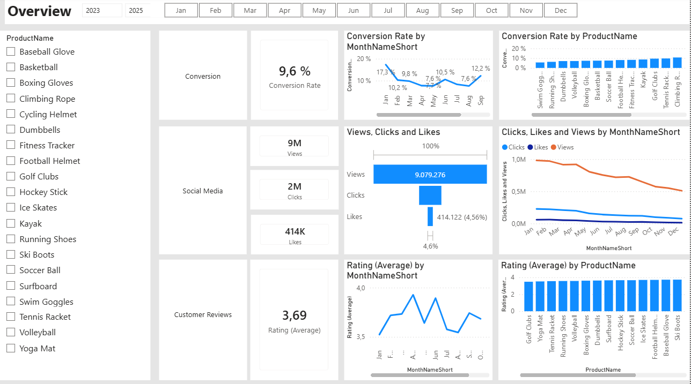
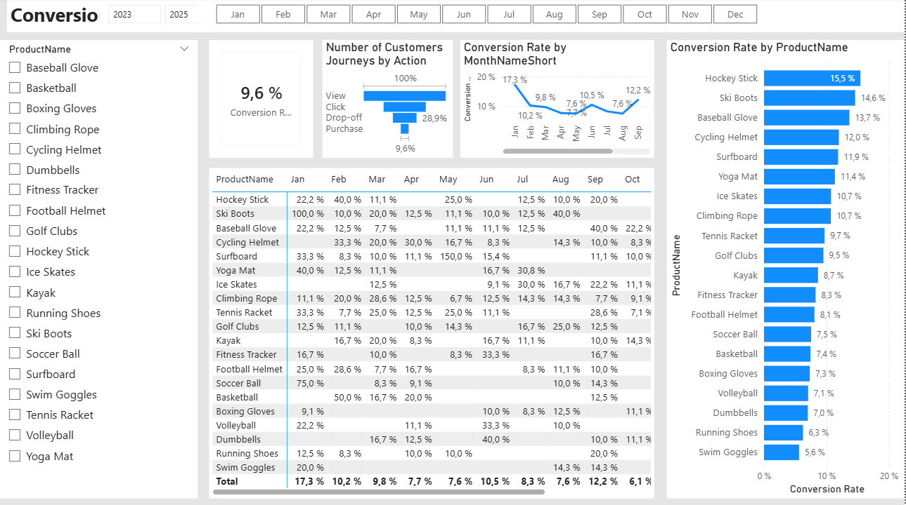
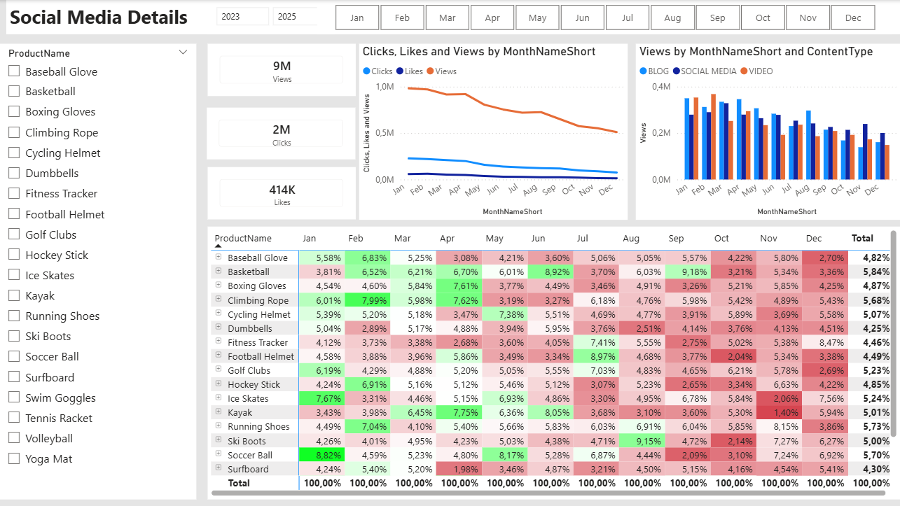

# Marketing-Data-Pipeline-Project

End-to-end data pipeline analyzing marketing data and customer sentiment. Built using SQL for ETL and data cleaning, Python (Pandas & NLTK VADER) for sentiment analysis feature engineering, and Power BI for interactive executive dashboards tracking conversion rates and social media KPIs.

---

## 🛠️ Tech Stack & Tools
* **SQL Server:** Data extraction, advanced cleaning, and data modeling.
* **Python (Pandas & NLTK VADER):** Natural Language Processing (NLP) for customer review sentiment analysis.
* **Power BI:** Data modeling, DAX metrics, and interactive executive dashboard creation.

---

## 🔄 Core Technical Pipeline

### 1. Advanced Data Cleaning & ETL (SQL)
Using a relational database, I wrote optimized SQL queries to extract and transform raw data into a reliable source of truth. Major operations included:
* **Customer & Product Modeling (`1_...sql`, `2_...sql`):** Standardized customer geography records and engineered a custom tiering system to classify items into Price Categories.
* **Metric Parsing (`4_...sql`):** Cleaned social media performance data by splitting combined raw text strings into distinct numerical metrics (**Views** and **Clicks**).
* **Duplicate Elimination & Null Imputation (`5_...sql`):** Resolved data quality issues in clickstream records using subqueries and window functions (`ROW_NUMBER()`) to strip out duplicate records, while dynamically imputing missing interaction durations using computed historical averages (`COALESCE` + `AVG OVER`).

### 2. Sentiment Text Enrichment (Python)
Recognizing that raw customer review data is hard to quantify, I extracted review data directly from SQL Server using Python (`Customer_Reviews_Table_enrichments.py`).
* **Natural Language Processing (NLP):** Utilized the `nltk` library’s **VADER Sentiment Intensity Analyzer** to generate text polarity compound scores.
* **Feature Engineering:** Formulated a custom business logic algorithm combining textual sentiment scores with numerical 1–5 star ratings to classify responses into actionable buckets. The final enriched output is saved as `fact_customer_reviews_with_sentiment.csv`.

### 3. Business Intelligence Dashboards (Power BI)
I integrated the cleaned, enriched outputs into Power BI to create an executive analytics ecosystem across three customized interfaces:

#### Overview Dashboard
Highlights global KPIs like total views (9M), clicks (2M), overall conversion rate (9.6%), and a unified monthly performance timeline.

#### Conversion Details
Deconstructs customer drop-off bottlenecks utilizing a funnel visual alongside an interactive monthly product-conversion matrix.

#### Social Media Details
Breaks down click-through and like percentages segmented by content formats (Blog, Social Media, Video), allowing marketing managers to isolate exact patterns driving engagement.

---

## 📊 Key Insights
* **Top Performers:** Video content consistently drives higher view-to-click conversion rates compared to static blogs.
* **Sentiment Impact:** Products with strong negative text sentiment see a higher drop-off rate in the shopping journey funnel, even if their baseline star rating is average.

---

## 💾 How to Replicate the Database
The raw data for this project is included in the root folder as a SQL Server Backup (`.bak`) file. 
To run the SQL scripts locally:
1. Download the `.bak` file from this repository.
2. Open **SQL Server Management Studio (SSMS)**.
3. Right-click **Databases** $\rightarrow$ select **Restore Database...**
4. Choose **Device**, locate the downloaded `.bak` file, and click **OK** to restore.

---

## 🌟 About Me

Hi there! I'm **Ali Abdul Nabi**. A passionate Master's Student in Informatics at the University of Duisburg-Essen focused on data analytics, SQL, Power BI, and Python for data analysis.

